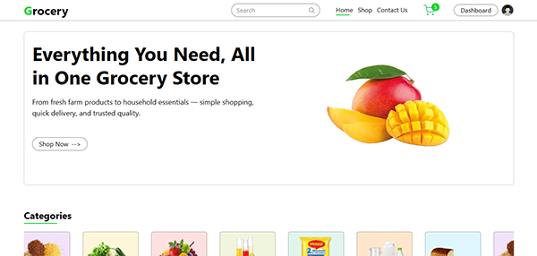
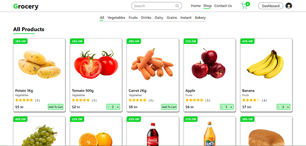
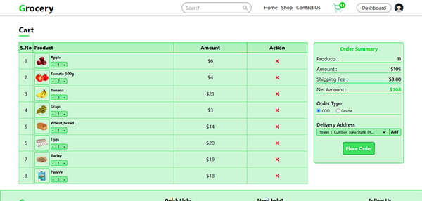
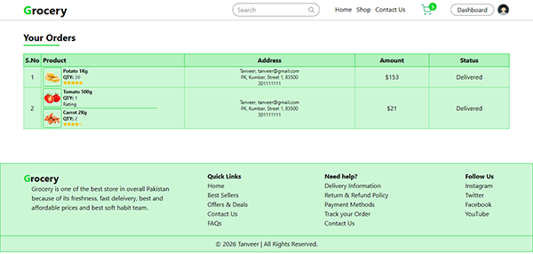
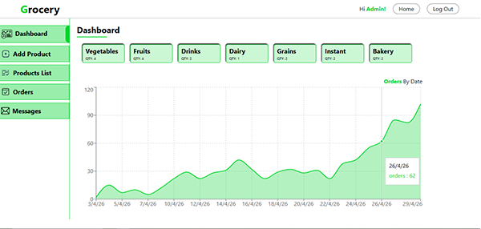
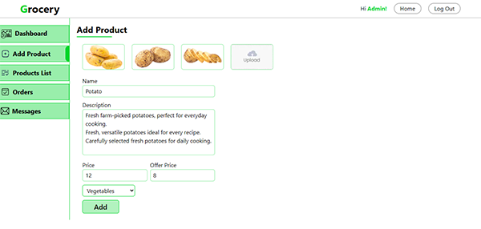
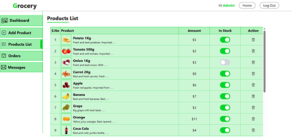
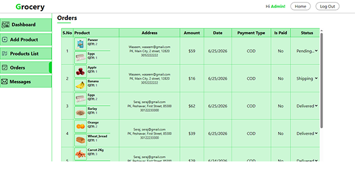

# 🛒 Grocery - Full Stack E-Commerce Website

A modern, fully responsive Full Stack Grocery E-Commerce Platform built with Next.js, MongoDB, Stripe, Cloudinary, and JWT Authentication.
<br/><br/>

## 🌐 Live Demo

🔗 Website: https://fullstack-grocery-ecommerce.vercel.app
<br/><br/>

## 📸 Screenshots

### 👦 Customer Interface






---

### 👨‍💼 Admin Interface





<br/><br/>

## ✨ Features

### 👦 Customer Features

- Beautiful and modern UI
- Fully Responsive Design
- Browse all grocery products
- Product Categories
- Product Search
- Shopping Cart
- Quantity Update
- Remove Cart Items
- Secure Checkout
- Stripe Payment Integration
- Order Placement
- Order History
- Product Ratings
- Contact Page

### 👨‍💼 Admin Features

- Secure Admin Login
- JWT Authentication
- Protected Admin Routes
- Add New Products
- Edit Products
- Delete Products
- Manage Customer Orders
- Dashboard Analytics
- Order Statistics Chart
- Sales Overview
  <br/><br/>

## 🔒 Security

- JWT Authentication
- Protected API Routes
- Protected Admin Dashboard
- Secure Login System
- Authentication Middleware
- Unauthorized users are automatically redirected to the Home Page.
  <br/><br/>

## 📊 Dashboard

The Admin Dashboard provides useful business insights including:

- Total Orders
- Order Analytics
- Daily Orders Chart
- Product Management
- Customer Orders Management
  <br/><br/>

## 💳 Payment

Integrated with Stripe for secure online payments.
Features include:

- Secure Checkout
- Online Card Payments
- Payment Verification
  <br/><br/>

## ☁️ Image Management

Product images are stored using Cloudinary, providing:

- Fast Image Delivery
- Cloud Storage
- Optimized Images
  <br/><br/>

## 📱 Responsive Design

The website is fully responsive and optimized for:

- Desktop
- Laptop
- Tablet
- Mobile Devices
  <br/><br/>

## 🛠 Tech Stack

### Frontend

- Next.js
- React.js
- Tailwind CSS
- JavaScript

### Backend

- Next.js API Routes
- Node.js

### Database

- MongoDB
- Mongoose

### Authentication

- JSON Web Token (JWT)

### Payment

- Cash On Delivery (COD)
- Stripe

### Image Hosting

- Cloudinary

### Deployment

- Vercel
  <br/><br/>

## 🚀 Getting Started

### Clone the repository

```bash
git clone https://github.com/tanveer-habib/Fullstack-grocery-ecommerce.git
```

### Navigate into the project

```bash
cd project-name
```

### Install dependencies

```bash
npm install
```

### Create Environment Variables

Create a .env file in project root directory and add:

- MONGODB_URI=
- JWT_SECRET=
- STRIPE_SECRET_KEY=
- NEXT_PUBLIC_STRIPE_PUBLISHABLE_KEY=
- CLOUDINARY_CLOUD_NAME=
- CLOUDINARY_API_KEY=
- CLOUDINARY_API_SECRET=
  <br/><br/>

---

### Run the project

```bash
npm run dev
```

### Open:

🔗 URL: http://localhost:3000
<br/><br/>

## 🎯 What I Learned

During this project I gained practical experience with:

- Full Stack Development
- Next.js App Router
- MongoDB & Mongoose
- Authentication using JWT
- Stripe Payment Integration
- Cloudinary Image Uploads
- Protected Routes
- REST APIs
- Dashboard Development
- State Management
- Responsive Design
- Deployment on Vercel
  <br/><br/>

## 🔮 Future Improvements

- Product Reviews
- Wishlist
- Coupons & Discounts
- Email Notifications
- Inventory Management
- Sales Reports
- Dark Mode
- Search Suggestions
  <br/><br/>

## 👨‍💻 Author

### Tanveer Habib

Computer Science Student

Full Stack MERN & Next.js Developer
<br/><br/>

---

### ⭐ If you like this project, don't forget to Star the repository.
